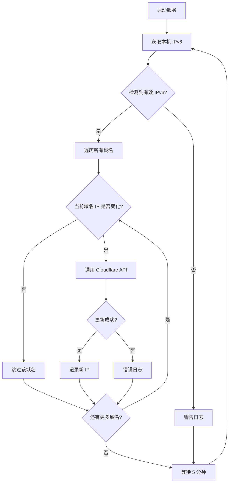

# my-ddns

> 一个轻量级的 IPv6 DDNS 服务，自动检测本机 IPv6 地址变化并更新 Cloudflare DNS AAAA 记录

## 项目愿景

提供一个极简、可靠的 DDNS 解决方案，专注于 IPv6 环境下的动态 DNS 更新，无需依赖第三方 DDNS 客户端，直接使用 Cloudflare API 实现自动化管理。

## 架构总览

单文件架构，使用 Node.js 原生 API（fetch、os）实现核心功能，通过定时任务检测 IP 变化并调用 Cloudflare API 更新 DNS 记录。

### 核心流程



## 技术栈

| 技术 | 版本 | 用途 |
|------|------|------|
| Node.js | >= 18 | 运行时环境（需支持原生 fetch） |
| TypeScript | ^5.9.3 | 类型安全 |
| pnpm | 10.18.3 | 包管理器 |
| PM2 | - | 进程管理（后台运行） |

**核心依赖**：
- `os` - 获取网络接口信息
- `fetch` - HTTP 请求（Node.js 18+ 原生支持）

**开发依赖**：
- `@types/node` - Node.js 类型定义
- `tsx` - TypeScript 开发运行
- `typescript` - TypeScript 编译器

## 目录结构

```
my-ddns/
├── index.ts           # 主程序（唯一源文件）
├── package.json       # 项目配置
├── tsconfig.json      # TypeScript 配置
├── README.md          # 用户文档
├── CLAUDE.md          # 架构文档（本文件）
├── dist/              # 编译输出目录
│   └── index.js       # 编译后的 JS 文件
└── node_modules/      # 依赖包
```

## 核心功能

### 1. IPv6 地址检测

**函数**: `getLocalIPv6()`

**逻辑**：
- 遍历所有网络接口
- 过滤条件：
  - `family === 'IPv6'`
  - 非内部地址（`!internal`）
  - 非链路本地地址（不以 `fe80` 开头）
  - 公网地址（以 `2` 或 `3` 开头）
- 优先选择静态地址（包含 `::` 的压缩格式地址）

**返回**: `string | null`

### 2. DNS 记录更新

**函数**: `updateDNS(domain: DomainConfig, ip: string)`

**参数**：
- `domain`: 域名配置对象（包含 ZONE_ID、RECORD_ID、DOMAIN_NAME）
- `ip`: 要更新的 IPv6 地址

**API 端点**: `PUT https://api.cloudflare.com/client/v4/zones/{ZONE_ID}/dns_records/{RECORD_ID}`

**请求头**：
- `Authorization: Bearer {TOKEN}`
- `Content-Type: application/json`

**请求体**：
```json
{
  "type": "AAAA",
  "name": "域名",
  "content": "IPv6 地址",
  "ttl": 600,
  "proxied": false
}
```

**错误处理**：
- API 错误：记录状态码和错误详情（包含域名标识）
- 网络异常：捕获 fetch 失败（DNS 解析、连接超时等）

### 3. 定时任务

**函数**: `task()`

**执行频率**: 5 分钟（可配置）

**逻辑**：
1. 获取当前 IPv6 地址
2. 遍历所有配置的域名
3. 对每个域名，与其上次记录的 IP 比较
4. 仅在 IP 变化时调用 API 更新该域名

**状态管理**：使用 `Map<string, string>` 为每个域名独立跟踪 IP 变化

## 配置说明

### 配置项（index.ts 中的 CONFIG 对象）

```typescript
const CONFIG = {
    TOKEN: "7oBL4kOPPqkShnzunMKuDgVjbx7vcXULdQXIyplM", // API Token
    INTERVAL: 1000 * 60 * 5,                          // 检查间隔（毫秒）

    // 域名列表（支持多个域名）
    DOMAINS: [
        {
            ZONE_ID: "fe797966e7daa570eacfd276df7e028e",
            RECORD_ID: "bbead75ce879dc8c66bc9a24b4e6ad75",
            DOMAIN_NAME: "mrseven.de5.net",
        },
        {
            ZONE_ID: "ff36c2054ef65ffb8e347c00aa13b760",
            RECORD_ID: "875076d1b6f61b4f66f12f3e29f35963",
            DOMAIN_NAME: "home.mr75.online",
        }
    ]
};
```

### 获取 Cloudflare 配置

1. **ZONE_ID**:
   - 登录 Cloudflare 控制台
   - 选择域名
   - 右侧栏查看 Zone ID

2. **RECORD_ID**:
   ```bash
   curl -X GET "https://api.cloudflare.com/client/v4/zones/{ZONE_ID}/dns_records?type=AAAA&name={域名}" \
     -H "Authorization: Bearer {TOKEN}"
   ```

3. **TOKEN**:
   - Cloudflare 控制台 → My Profile → API Tokens
   - Create Token → Edit zone DNS 模板
   - 权限：Zone.DNS (Edit)

## 运行与开发

### 开发模式

```bash
# 安装依赖
pnpm install

# 开发运行（使用 tsx）
pnpm dev
```

### 生产部署

```bash
# 编译 TypeScript
pnpm build

# 直接运行
pnpm start

# 使用 PM2 后台运行
pm2 start dist/index.js --name my-ddns
```

### PM2 管理命令

```bash
pm2 logs my-ddns      # 实时日志
pm2 status            # 进程状态
pm2 restart my-ddns   # 重启服务
pm2 stop my-ddns      # 停止服务
pm2 delete my-ddns    # 删除进程
pm2 save              # 保存进程列表
pm2 startup           # 设置开机自启
```

### 日志输出示例

**启动日志**：
```
=== 原生 Fetch DDNS 服务启动 ===
Node 版本: v22.20.0
目标域名: mrseven.de5.net, home.mr75.online
当前 IPv6: 2408:xxxx::xxx
```

**更新日志**：
```
[更新] 正尝试将 mrseven.de5.net 更新为 -> 2408:xxxx::xxx
[成功] mrseven.de5.net 记录已更新！当前 IP: 2408:xxxx::xxx
[更新] 正尝试将 home.mr75.online 更新为 -> 2408:xxxx::xxx
[成功] home.mr75.online 记录已更新！当前 IP: 2408:xxxx::xxx
```

**错误日志**：
```
[警告] 未检测到有效的 IPv6 地址
[API 拒绝] mrseven.de5.net 状态码: 403
[网络异常] home.mr75.online 请求失败: fetch failed
```

## 测试策略

当前项目无自动化测试，依赖手动验证：

1. **功能测试**：
   - 运行 `pnpm dev` 观察日志输出
   - 验证 IPv6 地址检测是否正确
   - 检查 Cloudflare DNS 记录是否更新

2. **错误场景**：
   - 断网测试：验证网络异常处理
   - 无效 Token：验证 API 错误处理
   - 无 IPv6 环境：验证警告日志

## 编码规范

- **语言**: TypeScript (strict mode)
- **模块系统**: ES Modules (NodeNext)
- **目标版本**: ES2022
- **代码风格**:
  - 使用 `const` 声明常量
  - 函数使用 JSDoc 注释
  - 错误处理使用 try-catch
  - 类型标注使用 TypeScript 原生类型

## AI 使用指引

### 代码修改建议

1. **添加功能**：
   - 支持 IPv4 (A 记录)
   - 添加 Webhook 通知
   - 支持更多 DNS 提供商

2. **优化方向**：
   - 配置文件外部化（使用 .env）
   - 添加日志文件输出
   - 添加健康检查端点

3. **安全增强**：
   - 敏感信息加密存储
   - Token 权限最小化验证
   - 添加 API 请求重试机制

### 常见问题

**Q: 为什么不使用第三方 DDNS 库？**
A: 保持极简，避免依赖，直接使用 Cloudflare API 更可控。

**Q: 为什么优先选择包含 `::` 的地址？**
A: 压缩格式的 IPv6 地址通常是静态分配的，更稳定。

**Q: 如何处理 API 限流？**
A: 当前仅在 IP 变化时调用 API，频率很低（通常几天一次），不会触发限流。

**Q: 支持 IPv4 吗？**
A: 当前仅支持 IPv6 (AAAA 记录)，需要 IPv4 支持可修改 `getLocalIPv6()` 和 API 请求体。

## 变更记录 (Changelog)

### 2026-01-03 - 多域名支持
- 重构配置结构为 DOMAINS 数组，支持同时管理多个域名
- 为每个域名独立跟踪 IP 变化状态（使用 Map）
- 更新日志输出包含域名标识
- 添加第二个域名 home.mr75.online

### 2025-12-28 - 初始化文档
- 创建 CLAUDE.md 架构文档
- 记录项目结构和核心功能
- 添加配置说明和运行指南
